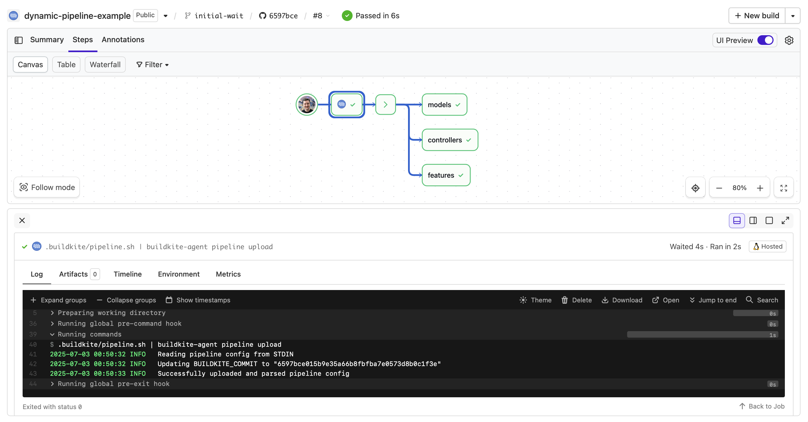

# Buildkite Dynamic Pipeline Steps Example

[](https://buildkite.com/buildkite/dynamic-pipeline-example)
[](https://buildkite.com/new)

This repository is an example [Buildkite](https://buildkite.com/) pipeline that shows how to programmatically generate dynamic steps using a shell script.

👉 **See this example in action:** [buildkite/dynamic-pipeline-example](https://buildkite.com/buildkite/dynamic-pipeline-example/builds/latest?branch=main)

[](https://buildkite.com/new)

<a href="https://buildkite.com/buildkite/dynamic-pipeline-example/builds/latest?branch=main">
  
</a>

<!-- docs:start -->

## How does it work?

This pipeline starts with a single job that runs:
```bash
.buildkite/pipeline.sh | buildkite-agent pipeline upload
```

The script [.buildkite/pipeline.sh](.buildkite/pipeline.sh) does the following:
* Creates a test step for each subdirectory in [specs](specs/)
* Adds a deploy step if the build is on the `main` branch


For non-main branches build it generates:

```yml
steps:
  - command: "specs/controllers/test.sh"
    label: "controllers"
  - command: "specs/features/test.sh"
    label: "features"
  - command: "specs/models/test.sh"
    label: "models"
```

For a `main` branch build it generates:

```yml
steps:
  - command: "specs/controllers/test.sh"
    label: "controllers"
  - command: "specs/features/test.sh"
    label: "features"
  - command: "specs/models/test.sh"
    label: "models"
  - wait
  - command: "echo Deploy!"
    label: ":rocket:"
```


## More ideas

What else could you do? The possibilities are endless. You can use this technique for custom deploy workflows, QA gates, conditional rollbacks, etc.

Tools like [Jobsworth](https://github.com/saymedia/jobsworth) use dynamic steps to manage complex deployment logic.

<!-- docs:end -->

## License

See [Licence.md](Licence.md) (MIT)
