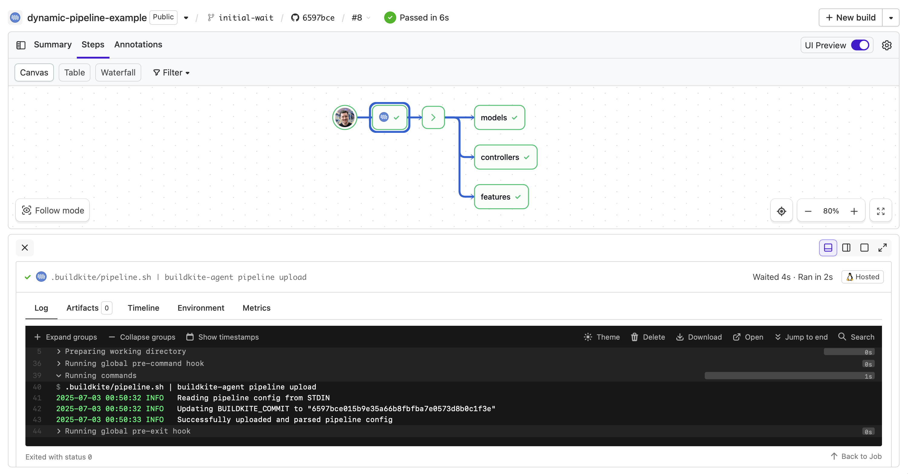

# Buildkite Dynamic Pipeline Steps Example

[](https://buildkite.com/buildkite/dynamic-pipeline-example)
[](https://buildkite.com/new)

This repository is an example [Buildkite](https://buildkite.com/) pipeline configuration that shows how to programmatically generate a build pipeline, allowing you to customize and distribute your build jobs however you wish.

👉 **See this example in action:** [buildkite/dynamic-pipeline-example](https://buildkite.com/buildkite/dynamic-pipeline-example/builds/latest?branch=main)

See the full [Getting Started Guide](https://buildkite.com/docs/guides/getting-started) for step-by-step instructions on how to get this running, or try it yourself:

[](https://buildkite.com/new)

<a href="https://buildkite.com/buildkite/dynamic-pipeline-example/builds/latest?branch=main">
  
</a>

## How does it work?

When a build is start it runs a single job first. This job executes `.buildkite/pipeline.sh | buildkite-agent pipeline upload`.

This [.buildkite/pipeline.sh](.buildkite/pipeline.sh) script does the following:

* Creates a separate test step for each directory in [specs](specs/)
* Adds a deploy step at the end only if the build is on the main branch

For a non-main branch build it generates:

```yml
steps:
  - command: "specs/controllers/test.sh"
    label: "controllers"
  - command: "specs/features/test.sh"
    label: "features"
  - command: "specs/models/test.sh"
    label: "models"
```

For a main branch build it generates:

```yml
steps:
  - command: "specs/controllers/test.sh"
    label: "controllers"
  - command: "specs/features/test.sh"
    label: "features"
  - command: "specs/models/test.sh"
    label: "models"
  - wait
  - command: "echo Deploy!"
    label: ":rocket:"
```

What else could you do? The possibilities are endless. For example [Jobsworth](https://github.com/saymedia/jobsworth) is a high-level tool that uses this to create deployments, rollbacks, QA steps, etc.

## License

See [Licence.md](Licence.md) (MIT)
